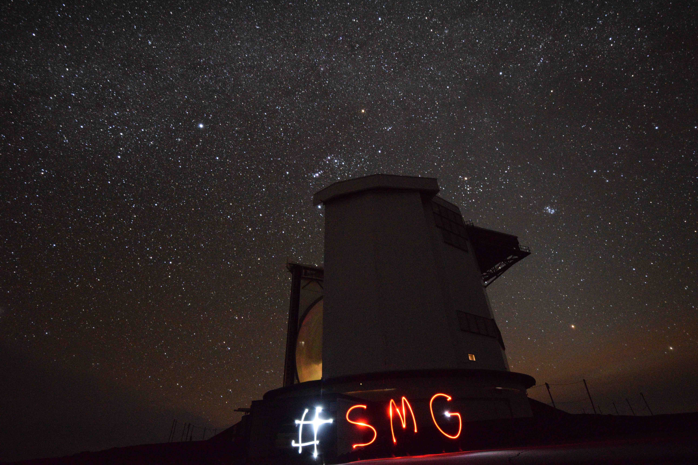

## Photos & Videos

  
  
  
  
  
  
  
  
  

<!-- blank line -->
<figure class="video_container">
  <video controls="true" width="600" allowfullscreen="true" poster="path/to/poster_image.png">
    <source src="0501night_UT4_1080p.mov" type="video/mp4">
  </video>
</figure>
*Wonderful night at the VLT (UT4) in Paranal, Chile.*
