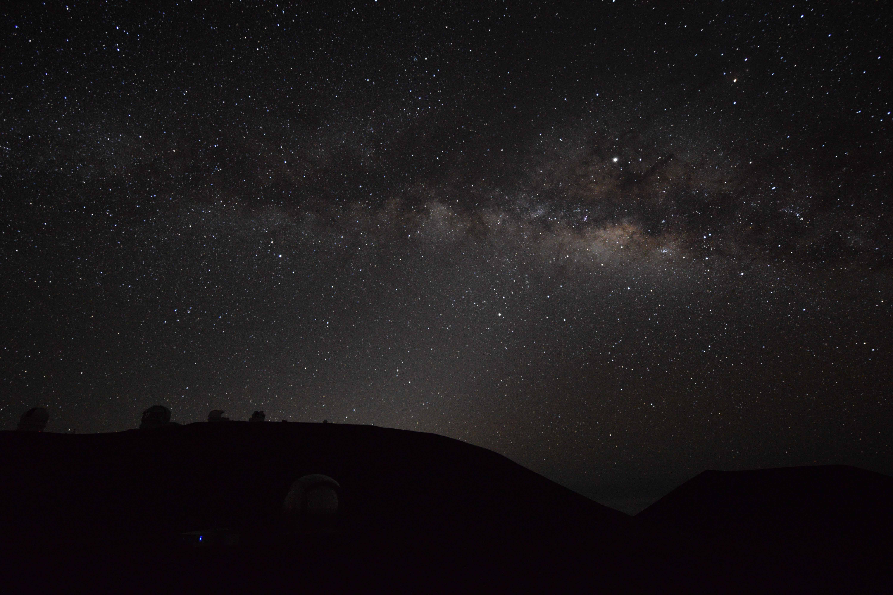

## Photos & Videos

 
*Noctilucent clouds over the Durham Cathedral.*

 
*Meteor crossing the Laser Guide Star AO of the Keck Observatory on top of Mauna Kea, Hawaii.*

 
*Milky Way on top of Mauna Kea, Hawaii.*

 
*Sunset with the Submillimetre Array (SMA) on top of Mauna Kea, Hawaii.*

 
*Beautiful morning after the last observing night at James Clerk Maxwell Telescope (JCMT) on top of Mauna Kea, Hawaii.*

 
*Milky Way and Jupiter with the James Clerk Maxwell Telescope (JCMT)*

 
*Panorama of the Milky Way on top of Mauna Kea, Hawaii.*
